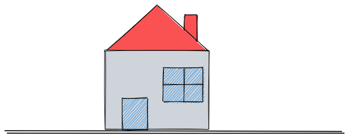
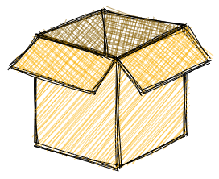
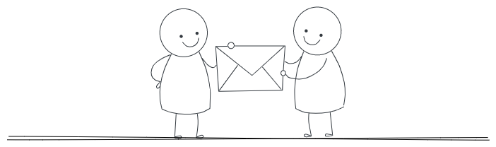

# What is Redux?
Redux is a state management library that allows you to manage the state of your JavaScript applications more efficiently and predictably.



Imagine you are building a house and need to keep track of all the materials you use and how much money you spend. Instead of keeping track of everything in your head or on a piece of paper, you could use a ledger to keep track of every transaction. Redux works similarly by keeping track of your application's state in a single place called the "store."

Let's say you're building an e-commerce site. You may need to keep track of the items in a user's cart, their payment information, and their shipping details.

Instead of passing this information from component to component using props, Redux allows you to store them in one central location where they can be easily accessed and updated. This makes it easier to manage complex states and keep your application organized.

It's important to note that Redux is not limited to React and you can use it with other frameworks or even vanilla JavaScript.

# Why Should I Use Redux?
Redux can help simplify the state management process, especially when dealing with complex and interconnected components. Here are some reasons why you might want to use Redux in your application:

Centralized state management: With Redux, you can maintain the state of your entire application in a single store, making it easier to manage and access data across components.
Predictable state updates: Redux has a clear flow of data, which means changes to the state can only happen when you create an action and send it through Redux. This makes it easy to understand how your application's data will change in response to user actions.
Easier debugging: With Redux DevTools, you have a clear record of all the changes to your application's state. This makes locating and fixing issues in your code easier, saving you time and effort in the debugging process.
Better performance: By minimizing the number of state updates and reducing the need for prop drilling, Redux helps improve your application's performance.

# How Does Redux Work?

As previously mentioned, Redux enables you to maintain a single centralized store that manages the state of your entire application. All components in your application can access this store and update or retrieve data from it as needed.

The key components that enable this centralized approach to state management are:

Store
Actions
Dispatch
Reducers
Let’s explore the role of each one:

## The Store
The Redux store is like a giant container that holds all the data for your application.



Think of the store as a box with different compartments for different data types. You can store any data you want in these compartments, and it can hold various kinds of data, such as strings, numbers, arrays, objects, and even functions.

Also, the store is the single source of truth for your application's state. This means that any component in your application can access it to retrieve and update data.

## Actions

An action is an object that describes what changes need to be made to the state of your application. It sends data from your application to the Redux store and serves as the only way to update the store.

An action must have a "type" property describing the action being performed. This "type" property is typically defined as a string constant to ensure consistency and avoid typos.

In addition to the "type" property, an action can have a "payload" property. The "payload" property represents the data that provides additional information about the action being performed. For example, if an action type is ADD_TASK, the payload might be an object containing a new task item's "id", "text", and "completed status".

Here's an example of an action:
```js
{
  type: 'ADD_TASK',
  payload: {
    id: 1,
    text: 'Buy groceries',
    completed: false
  }
}
```

Note that to create actions, we use action creators. Action creators are functions that create and return action objects.

Here is an example of an action creator that takes in a task's text and returns an action object to add the task to the Redux store:

```js
function addTask(taskText) {
  return {
    type: 'ADD_TASK',
    payload: {
      id: 1,
      text: taskText,
      completed: false
    }
  }
}
```

An appropriate analogy for actions and action creators would be a chef using a recipe. The recipe outlines the required ingredients and instructions to prepare a dish, similar to how an action in Redux specifies the needed details to modify the state of an application.


In this scenario, the chef represents the action creator, who follows the recipe to create the dish, similar to how an action creator creates an action based on predefined properties.

## Dispatch
In Redux, dispatch is a function provided by the store that allows you to send an action to update the state of your application. When you call dispatch, the store runs an action through all of the available reducers, which in turn update the state accordingly.



You can think of dispatch as a mail carrier who delivers mail to different departments in a large company. Just like how the mail carrier delivers mail to different departments, dispatch delivers actions to various reducers in your Redux store. Each reducer is like a department in the company that processes the mail and updates its own part of the company's data.

## Reducers
In Redux, a reducer is a function that takes in the current state of an application and an action as arguments, and returns a new state based on the action.

Here's an example of a simple reducer:

```js
const initialState = {
  count: 0
};

function counterReducer(state = initialState, action) {
  switch(action.type) {
    case 'INCREMENT':
      return { ...state, count: state.count + 1 };
    case 'DECREMENT':
      return { ...state, count: state.count - 1 };
    default:
      return state;
  }
}
```

In the above code, we have a simple reducer called "counterReducer" that manages the state of a count variable. It takes in two arguments: state and action. The state argument represents the current state of your application, while the action argument represents the action dispatched to modify the state.

The reducer then uses a switch statement to check the "type" of the action, and based on that type, it updates the state accordingly.

For example, if the action type is "INCREMENT", the reducer returns a new state object with the count incremented by 1. Also, if the action type is "DECREMENT", the reducer returns a new state object with the count decremented by 1.


A perfect analogy for a reducer would be a kitchen blender. Just like a blender takes in different ingredients, blends them, and produces a smooth mixture, a reducer takes in the current state of an application and an action, processes them together, and produces a new state.